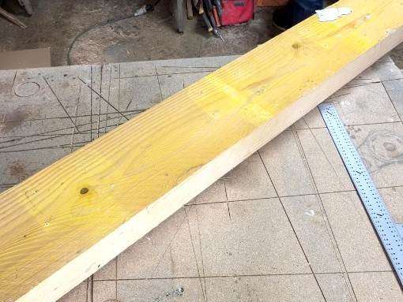
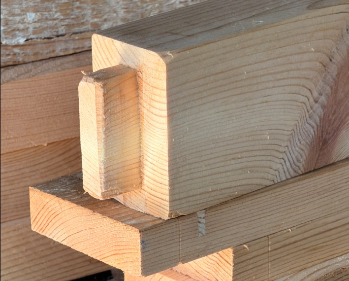



Aujourd’hui, je lance les découpes : plateau (déjà aux bonnes dimensions) et structure du meuble (pieds, traverses). Objectif : des pièces propres et identifiées pour attaquer les assemblages sereinement.

Je pars d’une vieille poutre récupérée lors de l’ouverture de la trémie dans la maison pour le passage de l’escalier. Rien ne se perd.

Vous pourrez trouver des informations complémentaires dans la section [Conception Bois](../../conception-bois) du projet Grenouille 3.0

---

## Objectifs du jour
- Déligner les pieds et les traverses du meuble.
- Mise à dimension finale des pièces de bois.

---

## Outils
- Mètre
- Équerre
- Crayon (porte-mine 0,5 pour la finesse du tracé)
- Scie sous table
- Scie à onglet
- Ponceuse orbitale (grain 120)

---

## Découpes (dans l’ordre)

### Délignage

On part de la poutre brute pour obtenir les pièces nécessaires :  
pieds × 4, traverses longues × 4, traverse courte × 1, traverses « points » × 4.

**Sections finales visées :**
| Pièce               | Section (mm) | Qté |
|---------------------|--------------|-----|
| Pied                | 70×40        | 4   |
| Traverse longue     | 70×30        | 4   |
| Traverse courte     | 70×40        | 1   |
| Traverse « points » | 70×20        | 4   |

### Tronçonnage

Découpes à +50 mm de la cote finale.

### Recoupe finale
Pour la coupe definitive,j'ulitise la **scie à onglet** avec une butée positionnée a la côte finale, tenue par un serre-joint et je fais les lots de pieces de la meme longeur d'une traite, si possible toutes ensemble, pour s'assurer qu'elles fasse exactement la même longueur.

### Mini-ponçage

Ponçage rapide au grain 120 et à la main sur les chants pour casser légèrement l’arête.
Je referais de toute facon un pocage definitif une fois l'assemblage terminé avant de passer à la finition.

---

## Contrôle et marquage
je sélectionne et marque le parement de chaque morceaux : orientation des pièces pour avoir les plus belles faces visibles et gagner du temps lors de l'assemblage.  

---

## Prochaine étape
je réalise les [tenons/mortaises](../j02-tenons-mortaises/) pour l’assemblage futur.

Topette !