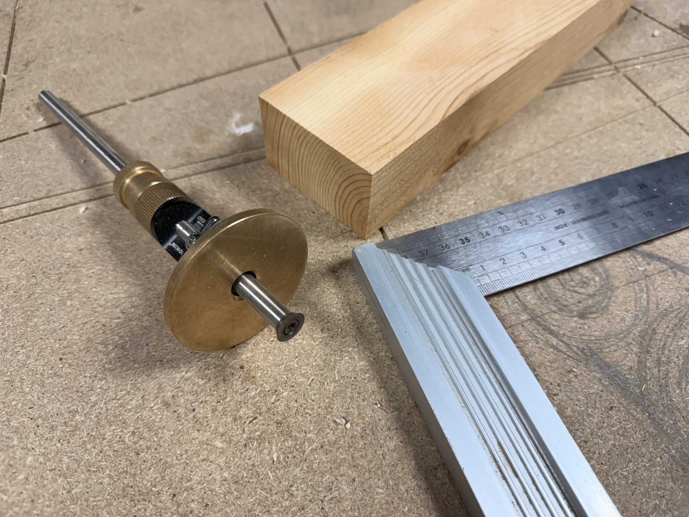

Aujourd’hui, je passe à la **réalisation des tenons et mortaises** avec une défonceuse équipée d'une **fraise de 12 mm**. Les mortaises seront donc **toutes à 12 mm**, et les tenons ajustés en conséquence. 

Objectif : des assemblages **propres** et un ajustage **serré**.

Vous trouverez des compléments utiles dans la section [Conception Bois](../../conception-bois).

---

## Objectifs du jour
- Centrer des **mortaises de 12 mm** dans les pieds.  
- Façonner des **tenons de 12 mm** sur les traverses (longues, courte, « points »).  

---

## Tracage au trusquin

| Élément                       | Épaisseur pièce | Offset trusquin (chaque joue) | Épaisseur tenon | Remarques |
|-------------------------------|-----------------|-------------------------------:|----------------:|-----------|
| Pied (70×40)                  | 40 mm           | 14 mm                          | 12 mm           | Mortaise centrée |
| Traverse longue (70×30)       | 30 mm           | 14 mm / 4mm                    | 12 mm           | Tenon non centré |
| Traverse courte (70×40)       | 40 mm           | 14 mm                          | 12 mm           | Tenon centré |
| Traverse « points » (70×20)   | 20 mm           | 4 mm                           | 12 mm           | Tenon centré |

---

## Profondeurs & longueurs (repères)

la profondeur (20mm) sera la meme pour toutes les mortaises afin de gagner du temps en gardant le meme reglage, et aussi eviter les erreurs.
Idem pour la longueur des tenons.

---

## Outils
- Trusquin, équerre.
- Défonceuse avec **fraise droite 12 mm** + guide parallèle.
- Ciseaux à bois.
- Scie sous tabl vpour les épaulements.
- Cale à poncer, rabot de paume (option), jauge/peignes d’épaisseur.
- Serre-joints.

---

## Étapes

### 1) Traçage


Je reporte les mesure vu au dessus avec le **trusquin**. Je me base toujours sur la **même face** pour mes tracages, pour etre sur des **alignements**. 

### 2) Mortaises


Réalisées à la **défonceuse** avec le guide parallèle, **plusieurs passes** jusqu’à la profondeur visée.  

### 3) Nettoyage au **ciseau**  


Je finalise les mortaise au ciseau à bois.

### 4) Tenons
- Couper les **épaulements** à la scie sous table.  
- Dresser les **joues** pour viser **12,0 mm** puis **finir à 11,8–11,9 mm** (ponçage fin).  
- Si vous laissez les mortaises **arrondies**, **arrondir les angles du tenon** (rayon 6 mm) au ciseau/rappe pour un emboîtement propre.

### 5) Essai à blanc & corrections
- Le tenon doit entrer **au pouce**, sans forcer.  
- Trop serré → poncer **une** joue (gardez la **parallélisme**).  
- Trop lâche → cale papier temporaire ou refaire (mieux maintenant qu’après collage).  
- Contrôle d’**équerrage** et des **diagonales** sur l’ensemble.

---

## Prochaine étape
[Assemblage **à blanc**, contrôle des diagonales, puis collage des éléments de la structure.](../j03-assemblage-collage)
Topette !
