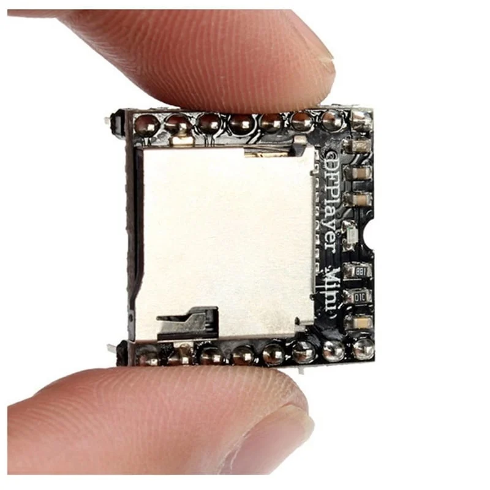

Je crois que c’est la première fois que je fais une étude hardware aussi poussée pour un projet perso.  
Mais la Grenouille 3.0 c’est un vrai jeu, un truc que j’ai envie de pousser jusqu’au bout : design, gameplay, animations, sons, lumières… le tout dans un meuble en bois que je fabrique moi-même.

Alors avant de foncer dans le code, j’ai voulu poser clairement ce dont j’avais réellement besoin pour ne pas me retrouver coincé plus tard.

## L’affichage : 128×64, la taille parfaite

Pourquoi 128×64 ?

- Ça ne dénature pas le style “pixel arcade”  
- Je peux afficher des chiffres en 16×16  
- Je peux avoir de vraies animations  
- Je peux séparer l’écran en zones : score / zone de jeu / messages  

Et surtout : ça donne de la place pour faire des trucs sympa, sans sacrifier la lisibilité.

## La détection : piezos + MCP3008

Le jeu repose sur l’impact : quand le palet tombe dans un trou, le jeu doit réagir instantanément.

Je garde donc :

- Des capteurs piezo  
- Branchés sur 2 MCP3008  
- Soit 14 entrées analogiques (Pour les 14 trous du jeu)

Pourquoi deux MCP3008 ?  
Parce que un MCP3008 peut gérer 8 entrées analogiques et ayant 14 capteurs, il m'en faut 2 (8x2=16, j'ai 2 entrées qui ne seront pas utilisées).

## Le son : DFPlayer Mini

Pour le son : bruitages, jingles, intro…, j'ai choisi un DFPlayer Mini.

Le DFPlayer Mini lit les MP3 tout seul, depuis une carte SD.

la charge de la lecture de son est déportée de l'ESP32.

## Les lumières : LEDs adressables

Des LEDs WS2812 / SK6812 autour du plateau pour :

- impacts  
- combos  
- transitions  
- modes de jeu  

L’ESP32-S3 gère ça proprement grâce au module RMT, sans bloquer le CPU.

## Le microcontrôleur : le vrai sujet

Entre les 4 panneaux HUB75, les animations, le son, les MCP3008, les LEDs, les effets et les modes de jeu…  

### ESP32‑S3 DevKitC‑1 N16R8

- **16 Mo de flash** → stocker sprites, polices, assets  
- **8 Mo de PSRAM** → buffers HUB75 + assets lourds  
- **CPU dual‑core 240 MHz** avec instructions vectorielles  
- **Assez de GPIO** pour tout brancher sereinement  
- **Compatibilité parfaite** avec HUB75, RMT, SPI, UART, DFPlayer  

## Est‑ce que tout rentre sur l’ESP32‑S3 ?

Oui, et largement.

| Élément | GPIO nécessaires |
|--------|------------------|
| HUB75 (4 panneaux) | ~13 GPIO |
| MCP3008 ×2 | 5 GPIO (SPI partagé + 2×CS) |
| DFPlayer Mini | 2 GPIO (UART) |
| LEDs | 1 GPIO (RMT) |
| Boutons | 3–4 GPIO |

Total ≈ 25 GPIO  
L’ESP32‑S3 en offre plus de 30 exploitables → tranquillité.

## L’alimentation : le point critique

Un panneau HUB75 consomme.  
Quatre, encore plus.  
Les LEDs aussi.

On part donc sur :

- une alimentation 5V robuste  
- un GND commun partout  
- une séparation logique / puissance  
- câblage propre, court, fiable  

La stabilité de l’alim est primordiale pour éviter bugs et parasitages.

## Architecture finale retenue

- **ESP32‑S3 N16R8** → cerveau  
- **4 panneaux HUB75** → 128×64  
- **2 MCP3008** → 14 capteurs piezo  
- **DFPlayer Mini** → son  
- **LED WS2812 / SK6812** → ambiance lumineuse  
- **Boutons** → Start, Mode, Service  
 

## Conclusion

Je voulais une architecture hardware qui ne limite ni la créativité ni les évolutions :

- sprites plus gros  
- plus de modes  
- animations plus riches  
- effets visuels avancés  
- plus de LED  
- pourquoi pas un système de pièces  

Avec cette base, je sais que je ne serai jamais bridé par le matériel.  
La seule limite sera mon imagination.

