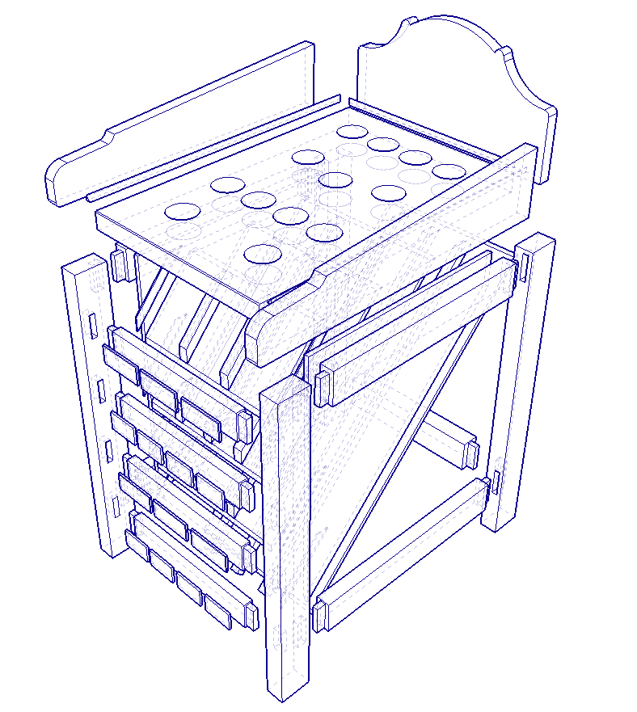
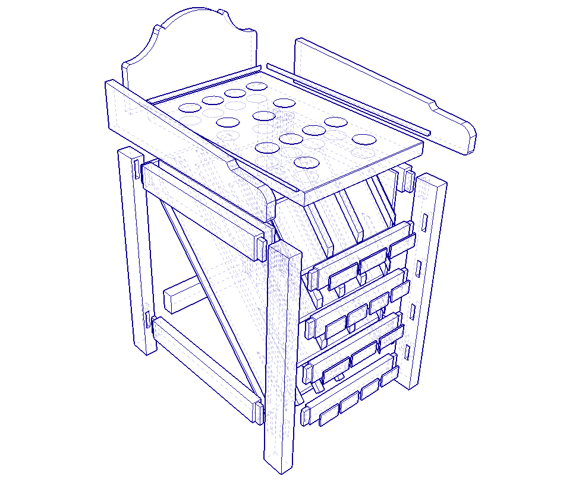

Après avoir posé les bases dans l’[introduction du projet][introduction], on entre maintenant dans le vif du sujet : 
la **vue d’ensemble** de la *Grenouille 3.0*.

---

## 2.1. Dimensions globales et ergonomie

L’objectif était simple : rester fidèle au **format traditionnel du jeu de la grenouille**.  
Parce qu’un beau jeu, c’est bien, mais un jeu agréable à utiliser — et qui en impose — c’est encore mieux.

Je travaille ici avec des **sections de bois importantes**.  
Pas que pour faire joli, mais aussi pour la **solidité**, la **longévité**.
Un jeu comme celui-là, c’est fait pour durer.

### Cotes de référence
Les modèles anciens varient beaucoup, mais on retrouve à peu près ces proportions idéales :
- **Hauteur totale :** entre 90 et 95 cm  
- **Largeur :** environ 40 cm  
- **Profondeur :** entre 80 et 85 cm  

Ces dimensions offrent un bon équilibre entre **jouabilité** (hauteur de lancer) et **stabilité** (base large).  
Adapté aux enfants, aux adultes et même aux concours de palets entre copains.

---

## 2.2. Composants structurels principaux

La **Grenouille 3.0** repose sur une **architecture simple et robuste**.  
Chaque élément a été pensé pour être **fabriqué facilement** avec un outillage classique.

### Le plateau supérieur  
Il accueille :
- La **grenouille en fonte**, évidemment 🐸  
- Les **arches** latérales (en fonte également) et les **trous de score**  

Le plateau est **entièrement démontable**, ce qui permet de le poncer, le vernir sans démonter toute la structure.

### Le corps du jeu
- Structure en **chêne massif** de 38mm.  
- Pieds en **Douglas** 70x40mm.  

### Rampes et bac à palets
En facade, 4 etages de rampes récuperent tous les palets tombés dans le plateau.  
- Réalisé en bois massif et en contreplaqué 10mm.    
- Guidage via cloisons entre les rampes pour éviter les rebonds.

### Box "Electronique"
- Contrelplaqué 10mm
- Accès via une porte à l'arriere.  
- Fermeture a clé.
- Ecran

---

## 2.3. Vision d’ensemble et modélisation 3D

Avant de sortir la scie, j’ai modélisé tout le projet sur **SketchUp**.  
La vue éclatée permet de comprendre la logique générale : comment chaque pièce s’emboîte.

### Vue éclatée
- Numérotation des pièces principales  
- Visualisation claire des volumes et des proportions  

Un travail de préparation indispensable avant d’attaquer la découpe.  
👉 Ça permet d’anticiper les assemblages, les passages de câbles et les points d’accès sans perdre de temps à l’atelier.

### Fabrication artisanale
Une **scie sous table**, une **défonceuse**, une **ponceuse orbitale** quelques **ciseaux a bois** et un peu de méthode suffisent.  
L’idée, c’est de garder un projet **accessible** et réalisable avec les outils dont je dispose.

---

## 2.4. Intégration électronique et électrique

C’est là que la magie opère.
La *Grenouille 3.0*, c’est un pont entre le **bois traditionnel** et la **tech moderne**.  
L’électronique ne vient pas "en plus" : elle est prévue dès la conception.

### Alimentation et sécurité
- Alimentation principale en **12 V**, propre et stable.  
- Conversion en **5 V** pour les LEDs, capteurs et l’ESP32.  
- Circuit protégé par un **fusible** et un **interrupteur général** accessible via la trappe arrière.

### Détection des palets
Chaque trou et arche est équipé d’un **capteur piézoélectrique**, connecté à un **MCP3008**.  
- Les signaux sont analysés par un **ESP32**.  
- Les scores sont affichés en temps réel.  
- Aucune pièce visible, tout est intégré discrètement sous le plateau.

### Éclairage et feedback visuel
Les **LEDs adressables WS2812B** ajoutent une vraie dimension visuelle :  
- Effets lumineux dynamiques à chaque point marqué. 
- Modes “démo” ou “ambiance” selon le contexte  
- Intégration dans des **profilés silicone plats encastrés** pour un rendu propre et homogène.

### Le cerveau du jeu
Le **ESP32-S3** gère tout : détection, animations, communication.  
- Connectivité **Wi-Fi / Bluetooth** intégrée.  
- Compatible avec un **panneau HUB75** pour l’affichage des scores.  
- Prêt à accueillir une **carte son** pour les sons d’ambiance ou les effets flipper-style 🎵.

### Câblage et modularité
L’ensemble est pensé pour durer :  
- Connecteurs **détachables** pour un remplacement facile.  
- Câblage propre dans des **goulottes internes**.  
- Chaque module (LED, capteur, carte) peut être remplacé sans tout démonter.  

---

## En résumé

Cette vue d’ensemble, c’est la **carte du projet Grenouille 3.0**.  
Elle permet de comprendre la logique complète — bois, électronique et ergonomie — avant de lancer la fabrication.

Les prochaines étapes plongeront dans le concret :
- Le **choix des essences de bois**
- Les **assemblages et découpes**
- Et plus tard, la **mise en place du proto électronique**

➡️ **Prochain chapitre :** [Conception bois et outillage][conception] — on passe enfin à la pratique !

---

[introduction]: ../introduction
[conception]: ../conception-bois