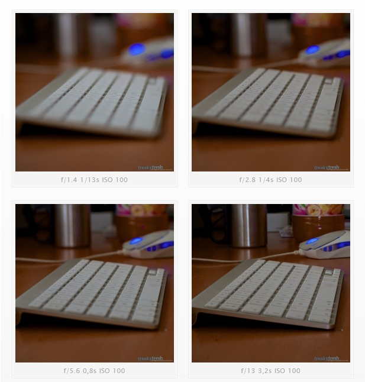

De plus en plus d’amis (et j’ai l’impression que c’est une tendance générale) aiment faire de **belles images**.  
La démocratisation des capteurs photo performants dans les smartphones a permis à beaucoup de voir la photo non plus comme un simple “instantané souvenir”, mais comme une **forme d’expression artistique**.

Avouez qu’il est tentant de troquer son carnet de notes pour un **papier Canson et quelques pinceaux** ?  
Bon, ma métaphore est un peu bancale 😄, mais tu vois l’idée. Ici, on parlera surtout du côté **qualitatif et artistique** de la photo, sans juger ton approche.  
Ces bases sont essentielles - elles te permettront de mieux comprendre pour ensuite mieux t’en affranchir et te concentrer sur la **création**.

---

## Préambule

Pour obtenir une **photo bien exposée**, il faut connaître les **trois paramètres fondamentaux** qui influencent l’exposition.  
Un cliché bien exposé est une image qui capture **le maximum d’informations lumineuses**, entre les tons clairs et les ombres profondes.

Ces trois paramètres sont liés entre eux, et chacun influence différemment le rendu final :

1. **L’ouverture** (celle qu’on étudie ici)  
2. La **[vitesse d’obturation](../vitesse-dobturation/)**  
3. La **[sensibilité ISO](../sensibilite/)**  

Pour que ce soit digeste, chaque notion fait l’objet d’un article de cette série.

---

## L’ouverture

> L’ouverture relative (ou simplement “ouverture”) désigne le rapport entre la **distance focale** d’un objectif et le **diamètre de sa pupille d’entrée**.

C’est ce que dit Wikipédia.  
En pratique, l’ouverture correspond à **la taille d’ouverture du diaphragme** - c’est-à-dire la quantité de lumière que laisse passer ton objectif.

Prenons un exemple simple :  
Un objectif de **50 mm f/1.4** signifie que son diaphragme peut s’ouvrir jusqu’à **environ 35 mm** (50 ÷ 1.4).  
Une grande ouverture = beaucoup de lumière sur le capteur.

👉 L’ouverture est un **rapport**, donc :  
**plus le chiffre “f” est petit, plus l’ouverture est grande.**  
Un objectif f/1.4 “ouvre” plus qu’un f/9. On dira donc qu’il est **lumineux**.

---

##  Effet sur la profondeur de champ

L’ouverture a un **impact direct sur la profondeur de champ** (la zone de netteté de ta photo) :

- **Grande ouverture (ex : f/1.8)** → profondeur de champ **faible** → **arrière-plan flou**  
- **Petite ouverture (ex : f/11)** → profondeur de champ **grande** → **plus de netteté dans l’image**

En résumé :  
> Plus tu ouvres, plus tu isoles ton sujet.  
> Plus tu fermes, plus tu rends l’image nette dans son ensemble.

 Pour aller plus loin, découvre mon article dédié au [**bokeh et à la profondeur de champ**](../profondeur-de-champ-et-bokeh/) : tu comprendras comment obtenir un flou d’arrière-plan maîtrisé et artistique.

---

## Applications concrètes

### Grande ouverture (f/1.4, f/2.8…)

- Effet d’arrière-plan flou : on appelle ça le **bokeh**.  
- Permet de **détacher le sujet** du fond.  
- Idéal pour les **portraits** ou les sujets isolés.  
⚠️ Attention à la **mise au point** : plus la zone de netteté est fine, plus il faut être précis - souvent sur les yeux pour un portrait.

---

### Petite ouverture (f/8, f/11, f/16…)

- Zone de netteté **plus large**, parfaite pour les **paysages**.  
- Moins de flou, mais **plus de détails nets** sur tous les plans.  
- Utile quand tu veux que tout ton cadre soit bien lisible.

---

## À retenir

Pour bien maîtriser l’ouverture, souviens-toi :

- 🔆 **Plus l’ouverture est grande (f/1.4, f/2.8)** → plus de lumière, moins de netteté globale  
- 🌙 **Plus l’ouverture est petite (f/11, f/16)** → moins de lumière, plus de netteté dans la profondeur  
- 🎯 **L’ouverture influence directement la profondeur de champ et le rendu artistique de ton image**

---

## Et ensuite ?

Tu comprends maintenant comment l’ouverture agit sur la **lumière** et la **profondeur de champ**.  
Dans le prochain article, on parlera de la **[vitesse d’obturation](../vitesse-dobturation/)** - le deuxième pilier du triangle d’exposition.  
C’est elle qui détermine la **durée** pendant laquelle ton capteur reçoit la lumière… et donc, le **mouvement** dans tes photos !
