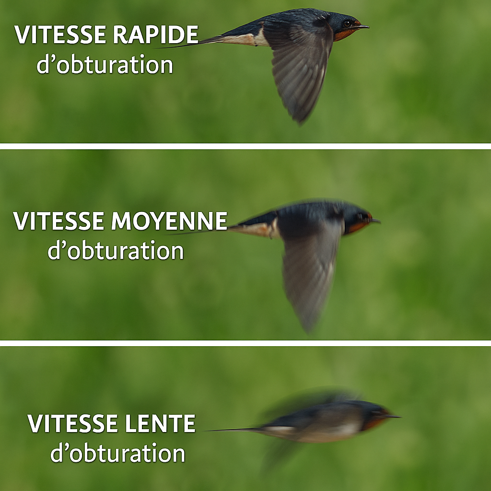

Salut à tous ! 👋  
Comme promis, voici la **deuxième partie** des bases de la photo.  

Je suis parti quelques jours à Orléans décompresser un peu, et ça a été l’occasion de faire un petit **drive-by en camping-car sur les bords de Loire**.  
Ambiance tranquille, et surtout : essais de **light painting** avec fusées scintillantes et feux d’artifice 🎆 — à creuser, le rendu est vraiment sympa !

Mais revenons à nos moutons : aujourd’hui, on parle de **vitesse d’obturation**.

---

##  Définition

Wikipédia, à toi 👇  
> En photographie, la vitesse d’obturation (appelée aussi *temps de pose* ou *durée d’exposition*) désigne l’intervalle de temps pendant lequel l’obturateur de l’appareil photo laisse passer la lumière — et donc la durée d’exposition du capteur ou de la pellicule.

Contrairement à l’ouverture (vue dans la [**première partie**](../bases-photo-ouverture/)), la vitesse d’obturation est plus simple à comprendre.  
Elle est exprimée en **secondes** ou **fractions de seconde** :  
`1/2500s`, `1/50s`, `1s`…  

Elle agit directement sur **le rendu du mouvement** — qu’il s’agisse du sujet, ou de ton propre bougé au moment de la prise de vue.

---

## Comprendre les effets

### Vitesse rapide

Une **vitesse rapide** (ex : 1/4000s) fige totalement l’action.  
Tu “arrêtes” littéralement le temps.  
➡️ Idéal pour les scènes sportives, les animaux en mouvement ou les éclaboussures d’eau.

### Vitesse lente

À l’inverse, une **vitesse lente** (ex : 1/2s, 2s, 10s…) laisse “filer” les éléments en mouvement.  
Les objets qui bougent deviennent flous, ce qui crée un **effet de dynamisme** ou de **filé artistique**.  

⚠️ Plus le temps d’exposition est long, plus le risque de **flou de bougé** (lié à tes propres mouvements) augmente.  
Sans trépied, il devient alors difficile d’obtenir une image nette.

---

## La règle de base : focale = vitesse minimale

Une règle simple pour éviter le flou de bougé :  
> La vitesse d’obturation doit être au moins égale à l’inverse de la **focale** utilisée.

Exemples :  
- 50 mm → vitesse minimale **1/50 s**  
- 200 mm → vitesse minimale **1/200 s**

C’est une **valeur repère** : avec un bon maintien, un peu d’entraînement, et la stabilisation optique de ton objectif ou boîtier, tu pourras parfois descendre en dessous.  

Mais garde cette règle en tête pour assurer la netteté “à tous les coups”.

---

## Pour aller plus loin

La vitesse d’obturation est l’un des trois **piliers de l’exposition**, avec :

1. **[L’ouverture](../bases-photo-ouverture/)** — qui contrôle la quantité de lumière et la profondeur de champ.  
2. **La sensibilité ISO** — que nous verrons dans la [troisième partie](../bases-photo-sensibilite/).

👉 En combinant ces trois paramètres, tu maîtriseras complètement **la lumière, le mouvement et le rendu artistique** de tes photos.

---

## À toi de jouer

Teste différents réglages :
- Fige un mouvement rapide (ex : une goutte d’eau, un oiseau, un enfant qui court)  
- Puis fais l’inverse : laisse volontairement filer un sujet en mouvement pour créer un effet fluide  

👉 Le secret, c’est d’expérimenter !  
C’est en jouant avec ces paramètres que tu comprendras instinctivement comment la **vitesse d’obturation** sculpte le temps… et donne vie à tes images.
