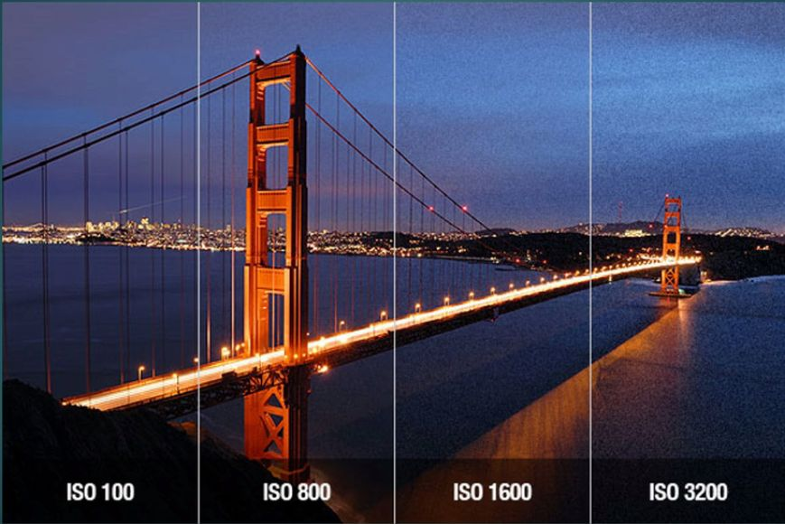

En photo, la **sensibilité d’un capteur** (ou d’une pellicule en argentique) définit sa **capacité à enregistrer la lumière**.  

À l’époque de l’argentique, c’était la **pellicule** elle-même qui possédait une sensibilité fixe.  
Il fallait donc **choisir à l’avance** sa pellicule - ISO 100, 400, 800 - et s’y tenir pour toute la bobine.  
Aujourd’hui, avec les **boîtiers numériques**, la sensibilité est gérée par le capteur et peut varier **instantanément**.  
Un vrai confort, puisqu’on peut **ajuster l’ISO en temps réel**, selon la lumière de la scène.

---

##  Qu’est-ce que la sensibilité ISO ?

La sensibilité d’un capteur se mesure en **ISO**.  
La plupart des appareils couvrent une plage de **100 à 6400 ISO** (voire plus sur certains modèles pros).  

- Plus on monte en ISO → plus le capteur est **sensible à la lumière**  
- Mais plus on augmente aussi le **bruit numérique** (grain) et la **perte de définition**

C’est donc, encore une fois, une **histoire de compromis** :  
monter en ISO permet de conserver une **[vitesse d’obturation](../bases-photo-vitesse-obturation/)** correcte même en faible lumière,  
mais cela dégrade légèrement la qualité de l’image.

---

## La règle générale

> Utilise toujours la **valeur ISO la plus basse possible**,  
> sauf si la lumière manque ou que tu veux figer un mouvement rapide.

En résumé :
- ISO bas (100–200) → **image propre**, parfaite en extérieur lumineux  
- ISO moyen (400–800) → **bon équilibre**, idéal en intérieur ou par temps couvert  
- ISO haut (1600 et +) → **plus de lumière**, mais aussi **plus de bruit**

---

## Tout est lié

Souviens-toi : la photo repose sur trois paramètres qui interagissent en permanence,  
le fameux **triangle d’exposition** :

1. **[L’ouverture](../bases-photo-ouverture/)** → contrôle la quantité de lumière et la **profondeur de champ**  
2. **[La vitesse d’obturation](../bases-photo-vitesse-obturation/)** → gère le **mouvement** et la **durée d’exposition**  
3. **La sensibilité ISO** → ajuste la **réactivité du capteur à la lumière**

Augmenter l’un nécessite souvent de compenser avec les deux autres.  
Par exemple, monter en ISO te permet d’utiliser une vitesse plus rapide, pratique pour figer un sujet sans flou.

---

## Exemple visuel

Voici une série d’images illustrant l’impact de la montée en ISO :  

  

Sur des **crops à 100 %**, la différence est flagrante : plus on monte en ISO, plus le grain et la perte de détails deviennent visibles.

---

## Astuce post-traitement

Grâce aux progrès des logiciels de développement RAW (comme Lightroom, Capture One ou DxO PhotoLab),  
il est aujourd’hui possible de **réduire efficacement le bruit** généré par les hautes sensibilités.  

Mais attention : même si ces outils sont puissants, il vaut toujours mieux **limiter le bruit à la source** plutôt que de le corriger après coup.

---

## En pratique

Quand la lumière baisse :
1. Essaie d’abord d’**ouvrir davantage** ton diaphragme (f/2.8, f/1.8…)  
2. Si c’est insuffisant, **ralentis légèrement** ta vitesse (1/60s, 1/30s…)  
3. Et seulement ensuite, **augmente ton ISO**

Cette hiérarchie t’aidera à garder des images nettes et détaillées sans excès de bruit.

---

## Pour aller plus loin

Tu maîtrises désormais les **trois piliers** de la photographie :  

1. **[L’ouverture](../bases-photo-ouverture/)** → lumière & profondeur de champ  
2. **[La vitesse d’obturation](../bases-photo-vitesse-obturation/)** → mouvement & netteté  
3. **La sensibilité ISO** → équilibre lumière & qualité d’image  

Et pour prolonger ta compréhension du flou d’arrière-plan, découvre aussi mon article sur la **[profondeur de champ et le bokeh](../profondeur-de-champ-et-bokeh/)** 🎨 

---

## À toi de jouer

Tu as désormais toutes les clés pour **maîtriser ton exposition**.  
Passe ton boîtier en **mode manuel (M)** et amuse-toi à combiner ouverture, vitesse et ISO.  
Observe comment chaque réglage influence ton rendu, ta lumière, et l’ambiance générale de ta photo.

C’est maintenant **toi** qui décides de ton image - pas ton appareil 😉
