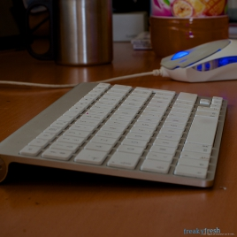
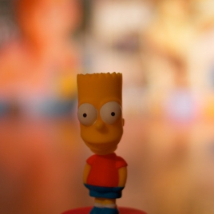
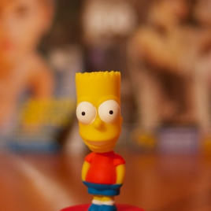
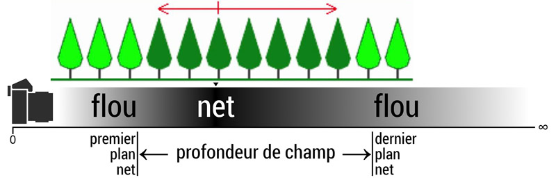

La **profondeur de champ (PDC)** détermine la zone de netteté d’une photo.  
C’est elle qui influence directement le **bokeh**, autrement dit le rendu du flou d’arrière-plan.  
Apprenons à la maîtriser simplement, sans formules compliquées, pour créer des images plus percutantes.

---

## 1. L’ouverture, c’est la base du flou

Petit rappel rapide (et utile) : **plus l’ouverture est grande (f/1.4, f/2.8…), plus la profondeur de champ est faible**.  
Cela signifie que seule une fine zone de ton image sera nette — le reste sera flou.

À l’inverse, avec une **petite ouverture (f/11, f/16…)**, une plus grande portion de ta photo sera nette, de l’avant à l’arrière.

👉 Le chiffre du “f” est un peu trompeur : plus il est petit, plus l’ouverture est grande.

**Exemples**

---

## 2. Distance entre le sujet et l’arrière-plan : un levier majeur pour le bokeh

Même si l’ouverture ne change pas, **le flou d’arrière-plan (le bokeh)** sera plus prononcé si ton sujet est **loin de l’arrière-plan**.

Plus le fond est éloigné, plus il part dans le flou.  
C’est purement une question de perception, mais ça fonctionne à tous les coups.

🎯 **Astuce simple :** évite de coller ton sujet contre un mur. Avance-le un peu, et laisse respirer le fond.

---

## 3. Distance entre ton boîtier et le sujet : plus près, plus flou

Autre facteur important : **ta propre distance par rapport au sujet**.

Plus tu t’approches du sujet (en gardant la même focale et la même ouverture), plus la profondeur de champ se réduit.  
En gros, en te rapprochant, tu renforces l’effet de flou à l’arrière.

Tu l’auras compris, c’est **le combo gagnant** :  
> grande ouverture + sujet proche + fond éloigné = bokeh assuré.

---

## 4. Rendu final : pas que technique, aussi artistique

Le **bokeh**, ce n’est pas juste une question de netteté ou de flou.  
C’est aussi une **signature visuelle** : elle dépend de ton objectif, de la lumière et du contexte.

Certains objectifs offrent un bokeh doux et crémeux, d’autres plus nerveux, avec des formes circulaires ou hexagonales en fond.  
Il n’y a pas de bon ou de mauvais bokeh — juste des rendus différents.

---

## En résumé

Pour maîtriser la **profondeur de champ** et obtenir un **beau flou d’arrière-plan**, retiens ces 3 leviers simples :

- 🔆 **Ouvre grand** (petit chiffre f)  
- 👣 **Rapproche-toi du sujet**  
- 🌳 **Éloigne l’arrière-plan**

Ajoute un bon éclairage, un sujet intéressant… et tu as tout ce qu’il faut pour une photo qui claque.

---

## À toi de jouer

Maintenant que tu as les clés, sors ton boîtier et va tester tout ça.  
Prends des objets du quotidien, déplace-toi, varie les ouvertures et observe les changements.  
C’est en expérimentant que tu comprendras vraiment la magie de la **profondeur de champ**.

---

## Pour aller plus loin

Tu veux aller encore plus loin ?  
Essaie de jouer sur la **focale** : un téléobjectif (ex. 85mm ou 135mm) accentue naturellement le flou d’arrière-plan, même à ouverture moyenne.  
Et surtout : amuse-toi, c’est comme ça qu’on progresse !
