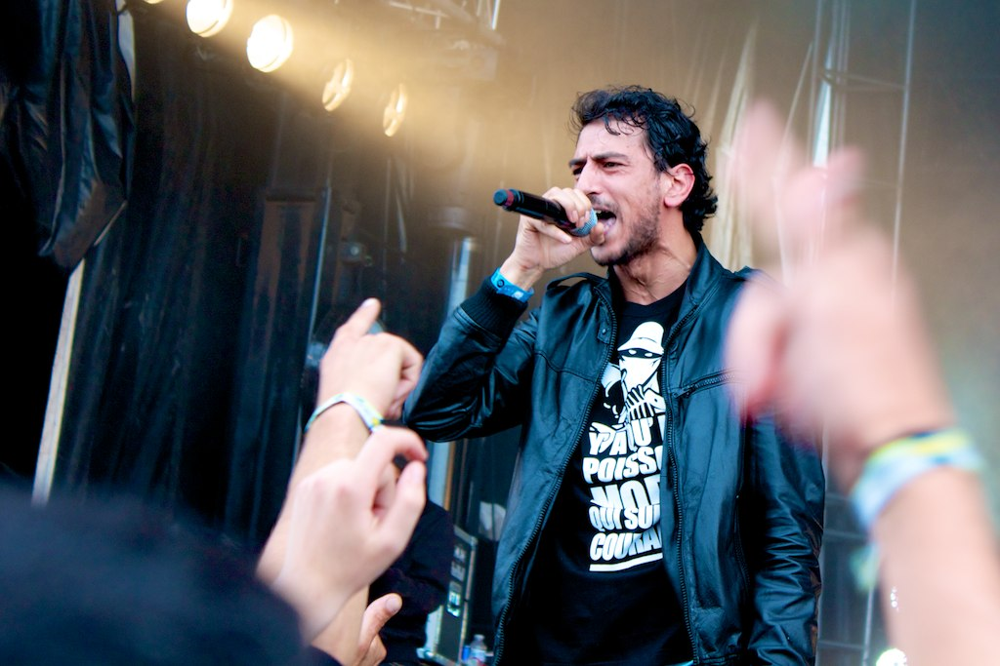
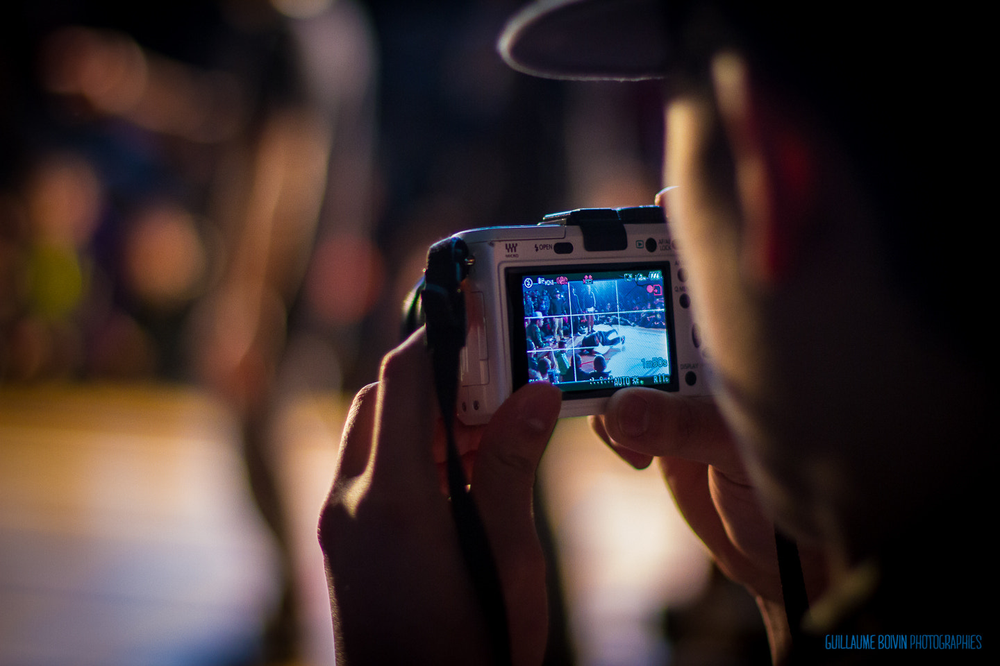

La photo de concert, c’est un vrai défi. On se retrouve souvent dans une salle plongée dans la pénombre, avec des spots qui clignotent dans tous les sens, et des artistes qui bougent sans arrêt. Bref, c’est pas franchement l’environnement le plus simple pour faire des images nettes, bien exposées et percutantes.

Mais c’est aussi ce qui rend l’exercice passionnant : si tu réussis à capturer **l’instant juste**, l’énergie du live, l’émotion sur un visage ou un rayon de lumière bien placé, ça devient magique.

Voici **mes 5 conseils de terrain** pour te donner toutes les chances de revenir avec des photos de concert qui claquent — même si tu n’as pas (encore) un matos de guerre.

## 1. Ouvre à fond

Les salles sont souvent très sombres, donc ton objectif doit **laisser entrer un maximum de lumière**. Autrement dit, il te faut une **grande ouverture**. Si tu peux shooter à f/2.8, c’est déjà pas mal. En dessous, c’est encore mieux.

Si tu débutes, un **50mm f/1.8** est un excellent rapport qualité/prix. C’est lumineux, compact, pas trop cher… mais il faudra être proche de la scène. Comme souvent en photo, tout est question de compromis. Tu gagnes en lumière, tu perds en flexibilité.

## 2. Monte les ISO sans pitié

Oui, le bruit numérique, c’est moche. Mais une image floue, c’est encore pire. En concert, tu n’auras souvent **pas le choix** : il faudra monter les ISO, parfois très haut.

Apprends à connaître les limites de ton boîtier. Jusqu’à quelle valeur tu trouves le résultat encore propre ? 1600 ? 3200 ? Plus ? Mets l’ISO en automatique si besoin, en fixant une valeur max.

Le but, c’est de garder une **vitesse suffisante** pour figer l’instant. Le bruit, tu verras plus tard en post-traitement. Mais le flou, lui, tu ne peux pas le rattraper.

![Youssoupha @ Le Chabada [Angers] 2012](img/youssoupha-chabada-2012.jpg)

## 3. Gère ta vitesse d’obturation

Pas de formule magique ici, mais une règle simple : **garde une vitesse assez rapide** pour éviter le flou de bougé — le tien ou celui du musicien. En général, 1/200s est un bon point de départ, mais adapte-toi à la scène.

Tu peux aussi **jouer avec le flou** volontairement. Un bras de batteur qui se brouille pendant que le visage reste net, ça raconte quelque chose. C’est vivant. Mais ne laisse pas le hasard décider à ta place : choisis ton effet.

![1995 @ Le Chabada [Angers] 2012](img/1995-chabada-2012.jpg)

## 4. Sois maître de ton exposition

En concert, l’arrière-plan est souvent très sombre, et les spots viennent cramer le visage du chanteur. Si tu laisses ton appareil en mesure “auto”, il va paniquer.

Utilise une **mesure spot** (ou pondérée centrale), pour que l’exposition se fasse **sur le sujet principal**. Même si le fond est bouché, ce n’est pas grave : ce qu’on regarde, c’est l’artiste.

Concentre-toi sur lui, et expose pour lui. Le reste, c’est du décor.

![Sams & Youssoupha @ le Chabada [Angers] 2012](img/youssoupha-chabada-2012-2.jpg)

## 5. Choisis ton mode autofocus

Deux écoles :  
– **One-Shot** (AF-S) : pour les moments calmes, les pauses.  
– **AI-Servo** (AF-C) : pour suivre un sujet en mouvement.

Moi, je shoote quasi tout le temps en **AI-Servo**. Ça me permet de me concentrer sur le cadrage, en sachant que l’appareil fait le focus en continu sur le sujet que j’ai visé. Super pratique quand les artistes bougent non-stop.

Teste les deux, et vois ce qui te met le plus à l’aise selon les situations.

## Et après ?

Tu veux un dernier conseil ? **Shoote beaucoup**. Ne te bride pas. Plus tu déclenches, plus tu multiplies les chances de capter le moment parfait. Et avec l’habitude, tu auras besoin de moins de photos pour en sortir une bonne.

Surtout, amuse-toi. La photo de concert, c’est une affaire de technique, oui, mais aussi de **sensibilité et d’anticipation**. Rentre dans l’énergie du show, ressens le truc… et déclenche quand tu le sens.