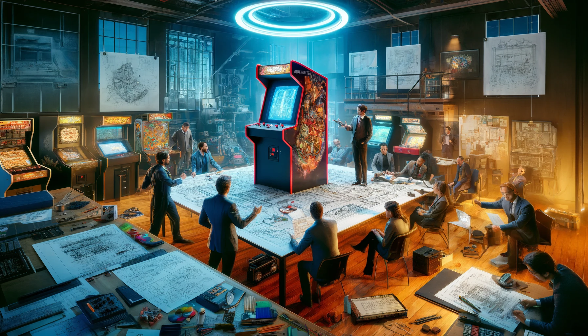
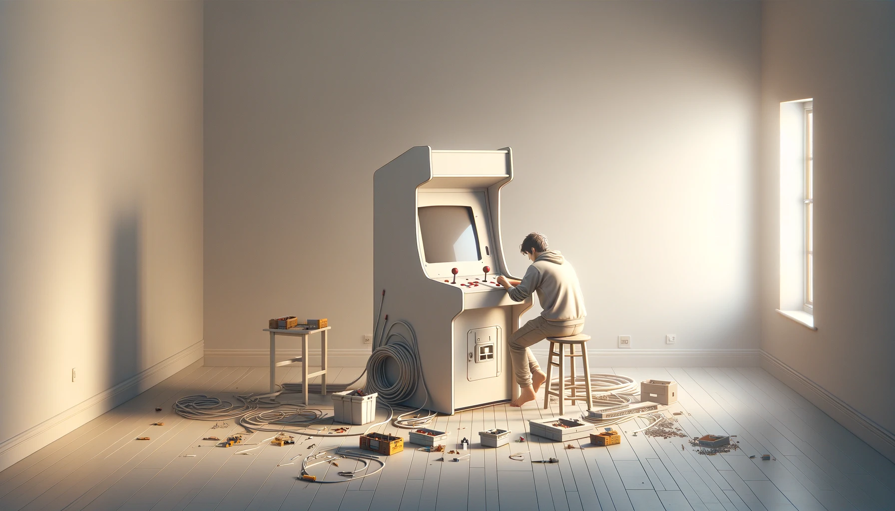
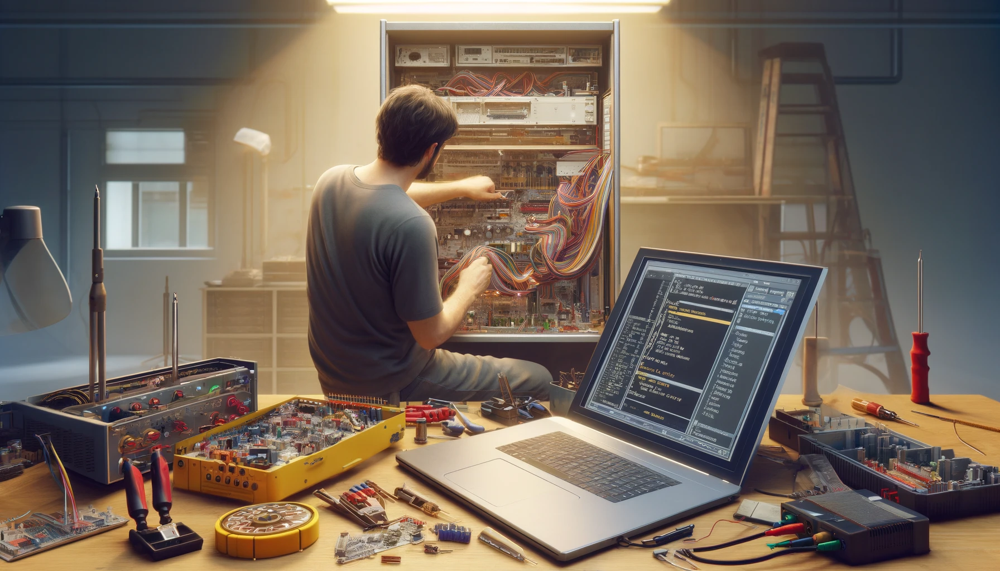
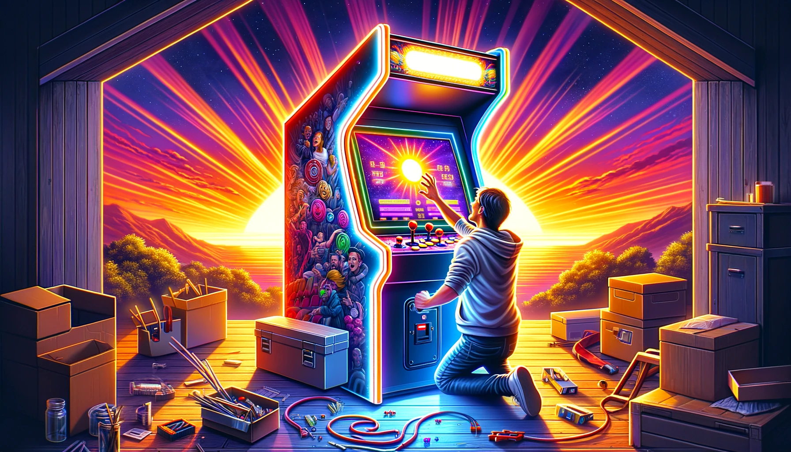


Ce billet sert de document de cadrage pour ma prochaine borne d’arcade 2 joueurs.
J’y rassemble les contraintes, les arbitrages et les pistes techniques avant de passer à la fabrication.


## Introduction
### Présentation du projet

Une borne d'arcade ravive immédiatement la nostalgie des jeux rétro, mais elle représente aussi un projet personnel particulièrement stimulant, à la croisée du bricolage, de la technique et du design. Ces machines emblématiques des salles d'arcade ont marqué des générations entières, et elles gardent aujourd'hui encore une vraie force d'évocation.

Créer sa propre borne d'arcade peut répondre à plusieurs envies à la fois. Pour certains, c'est une manière de retrouver les sensations des classiques comme "*Street Fighter*", "*Pac-Man*" ou "*Metal Slug*" à la maison. Pour d'autres, c'est surtout un défi personnel, une occasion d'apprendre et de progresser en électronique, en menuiserie, en intégration et en configuration logicielle.

Ayant déjà conçu et réalisé deux bornes d'arcade, une petite 1 joueur avec écran 9,7 pouces 4:3 d'iPad et une autre en 19 pouces toujours en 4:3 mais pensée pour 2 joueurs, j'ai pu accumuler une base d'expérience concrète. Chaque projet m'a permis d'affiner mes méthodes, de corriger mes erreurs et de mieux comprendre les compromis à faire entre encombrement, confort, budget et rendu final.

Cette nouvelle borne n'est donc pas un simple “projet de plus”. Elle synthétise tout ce que j'ai appris jusque-là, tout en servant aussi de terrain d'exploration pour les choix que je n'ai pas encore testés. L'idée est de construire une machine plus aboutie, plus cohérente et plus agréable à utiliser au quotidien.

Au-delà du jeu lui-même, je veux aussi en faire un bel objet, capable de trouver sa place dans une pièce de vie sans perdre son identité arcade. Ce billet sert donc de feuille de route : cadrer les choix, poser les contraintes, lister les idées, et garder une trace claire de la direction prise avant de passer à la fabrication.

---

### Aperçu des principaux défis

#### Défis Techniques

Le cœur du projet repose sur sa réussite technique. Cela inclut :

* **La Sélection des Composants :** Choisir les bonnes pièces (écran, hardware informatique, système d'exploitation, contrôleurs, son) qui sont compatibles entre elles et adaptées aux jeux que vous souhaitez jouer.
* **La Programmation et Configuration :** Installer et configurer le logiciel, les émulateurs et les jeux, tout en s'assurant que le système est stable et réactif.
* **L'Assemblage Physique :** Concevoir une structure solide et fonctionnelle, intégrer l'électronique de manière sécurisée et ergonomique, posant un défi particulier en termes de câblage et de disposition des composants.

#### Défis Esthétiques

L'apparence de la borne est tout aussi cruciale que sa fonctionnalité :

* **Design de la Borne :** Créer un design qui soit à la fois fidèle à l'esprit des arcades classiques et adapté aux goûts personnels et à l'environnement où la borne sera installée.
* **Personnalisation et Finitions :** Sélectionner des matériaux, des couleurs, et des artworks qui non seulement rendent hommage aux jeux classiques mais qui reflètent également une touche personnelle unique.
* **Ergonomie :** S'assurer que la borne est confortable pour deux joueurs, ce qui implique une réflexion approfondie sur les dimensions, la hauteur des contrôleurs, et l'angle de vue de l'écran.

#### Défis Financiers

Le budget est une considération incontournable, avec plusieurs facteurs à prendre en compte :

* **Coût des Composants :** L'acquisition de pièces de qualité (écran, carte mère, contrôleurs) peut rapidement devenir coûteuse.
* **Gestion du Budget :** Balancer les aspirations du projet avec un budget réaliste, ce qui peut nécessiter des compromis sur certains aspects ou une recherche approfondie pour trouver les meilleures offres.
* **Coûts Inattendus :** Prévoir une marge pour les dépenses imprévues, qu'il s'agisse de pièces supplémentaires ou de modifications nécessaires en cours de route.

Face à ces défis, il est important d'avoir une planification minutieuse, une recherche approfondie et une flexibilité pour s'adapter aux imprévus. La compréhension et l'anticipation permettront de naviguer plus facilement à travers le processus de création, transformant les défis en opportunités d'apprentissage.

---

## Planification et Conception

### Définir les Objectifs du Projet

* **Sélection des jeux :** Déterminer les types de jeux désirés (classiques, combats, plateforme, etc.) pour orienter le choix du matériel.

  > * Depuis les débuts de l'arcade “moderne” jusqu'à, pourquoi pas, la génération PS3 / Switch. Voir [Configuration hardware](#le-système-darcade).
  > * Priorité aux jeux horizontaux. Les jeux Tate resteront jouables, quitte à assumer des bandes noires ou à envisager plus tard une borne dédiée.
  > * Pas de spinner prévu : joystick 8-way, 6 boutons d'action, 1 bouton Start et 1 bouton Coin par joueur.
  > * Option à étudier : compatibilité lightguns avec 2 pistolets + émetteur IR.
  > * Option ouverte : quelques usages “pincab” légers, mais ce n'est pas l'objectif principal.

* **Expérience utilisateur :** Réflexion sur l’expérience de jeu (écran unique ou multiples, système sonore, etc.).

  > * Jeux 1 ou 2 joueurs.
  > * Écran 27 pouces 1440p.
  > * Son 2.1 (2 x 150 W + caisson).
  > * Réglage audio accessible rapidement.
  > * Environnement lumineux : boutons du panel + bandeaux LED RGB, façon “ambilight” assumée.
  > * Marquee lumineuse.
  > * Monnayeur fonctionnel, à définir proprement.
  > * Mode jukebox éventuel, sujet à creuser.
  > * Accès rapide clavier et souris pour la maintenance.
  > * Question ouverte : support de manettes filaires ou Bluetooth.

### Conception et Plans

#### Dimensions ergonomiques pour deux joueurs.

  > * Réflexion sur les dimensions optimales pour une borne 2 joueurs.
  > * Inclinaison de l'écran 27 pouces.
  > * Orientation idéale des enceintes et du caisson.
  > * Espacement entre les joueurs.

#### Élaboration des plans de la borne.

  > * Regroupement de toutes les idées et prérequis.
  > * Esquisses, roughs et arbitrages d'encombrement.
  > * Mise en 3D du design final, probablement sur Fusion 360.

#### Design et personnalisation esthétique.

  > * Choix du thème et des codes couleurs, avec phase d'inspiration.
  > * Création des visuels de vinyle.
  > * Éventuelle adaptation d'un thème LaunchBox à l'identité visuelle de la borne.

---

## Sélection des Composants

### L’Écran et l’Affichage

* Taille, type (LCD, LED), résolution, orientation (portrait ou paysage).

  > * Écran 27 pouces 16:9 QHD (OLED ?).
  > * 2560 × 1440 (6 × 240p).
  > * Orientation paysage, avec bezels éventuels pour les jeux 4:3.

### Le Système d’Arcade

* Options de plateforme (PC, Raspberry Pi, console modifiée).

  > * PC nu (pas de boîtier).

* Logiciels et systèmes d’exploitation (Windows, Linux, RetroPie).

### Les Contrôleurs
* Types de contrôles (joysticks, boutons, trackballs).
* Configuration pour deux joueurs.

### Le Son
* Système audio, choix des haut-parleurs et de l'amplificateur.

### Autres Composants
* Alimentation, éclairage LED, décoration.

---

## Construction

### Fabrication du Corps
* Découpe et assemblage du bois, méthodes et matériaux recommandés.
* Installation de l'écran, du système sonore, et des ventilateurs de refroidissement.

### Montage des Contrôleurs
* Placement et fixation des boutons et joysticks.

### Finitions et Personnalisations
* Peinture, vinyle, et décoration personnalisée.

---

## Installation et Configuration Logicielle

### Montage Électronique
* Câblage interne, connexion des contrôleurs, de l'écran, et du système audio.

### Configuration Logicielle
* Installation du système d’exploitation, des émulateurs, et des jeux.
* Mappage des contrôleurs.

### Tests et Ajustements
* Essais de fonctionnement, débogage, optimisation des performances.

---

## Finalisation et Lancement

### Révision Générale
* Vérification de la sécurité, de l'ergonomie, et de la fonctionnalité.

### Première Utilisation
* Organisation d'une session inaugurale, feedback des utilisateurs.

### Maintenance et mises à jour
* Conseils pour l'entretien, les mises à jour logicielles, et l'ajout de nouveaux jeux.

---

## Conclusion

### Retour d’Expérience
* Satisfaction personnelle, réactions des proches et visiteurs.

### Évolutions Possibles
* Ajouts futurs, modifications, extensions communautaires.

---

## Annexes
### Ressources Utiles

**Sites Web :**
* [Building a home Arcade Machine | retroMASH](https://retromash.com/2015/01/02/building-a-home-arcade-machine-part-1/)
* [Building your own Arcade Cabinet for Geeks | Scott Hanselman](https://www.hanselman.com/blog/building-your-own-arcade-cabinet-for-geeks-part-1-the-cabinet)
* [Arcade Controls](http://www.arcadecontrols.com)

**PDF :**
* [Project Arcade: Build Your Own Arcade Machine.](files/Project-Arcade-Build-Your-Own-Arcade-Machine.pdf)
---
