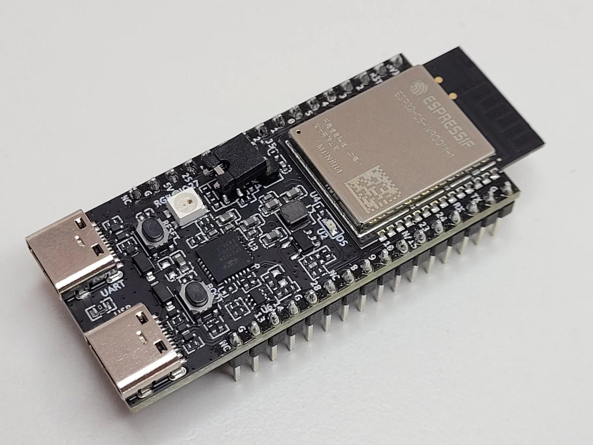
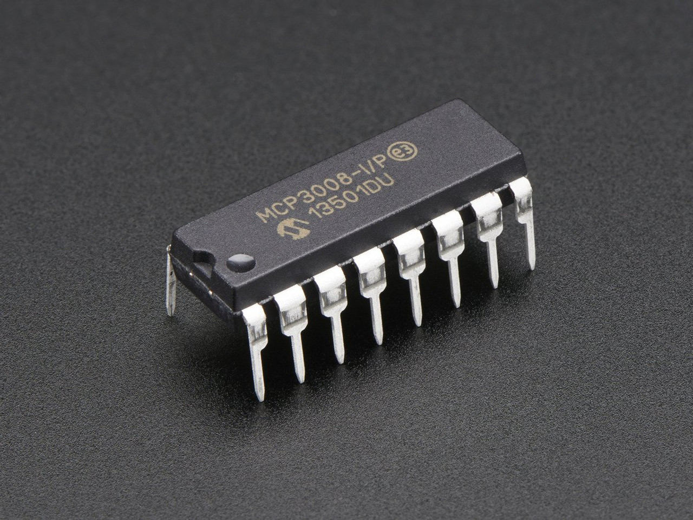
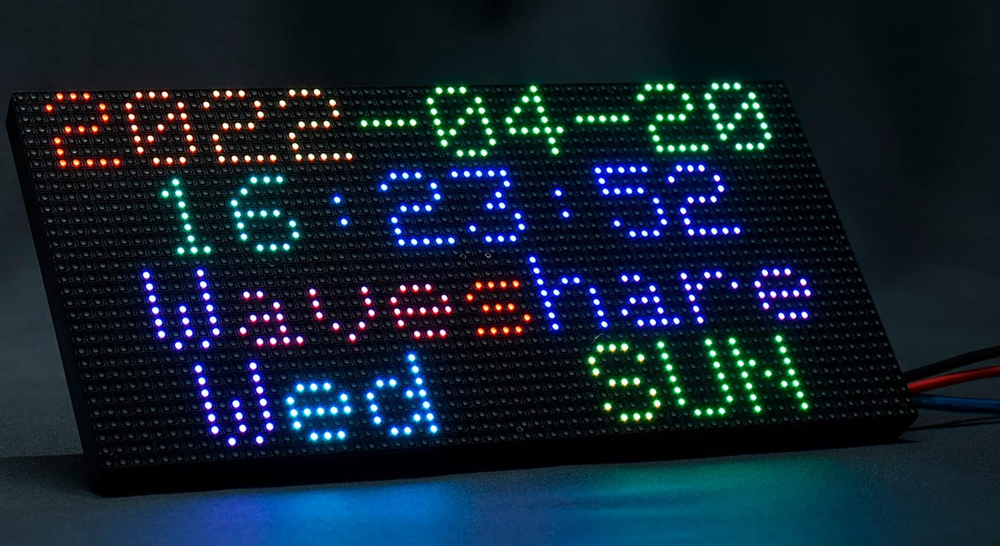
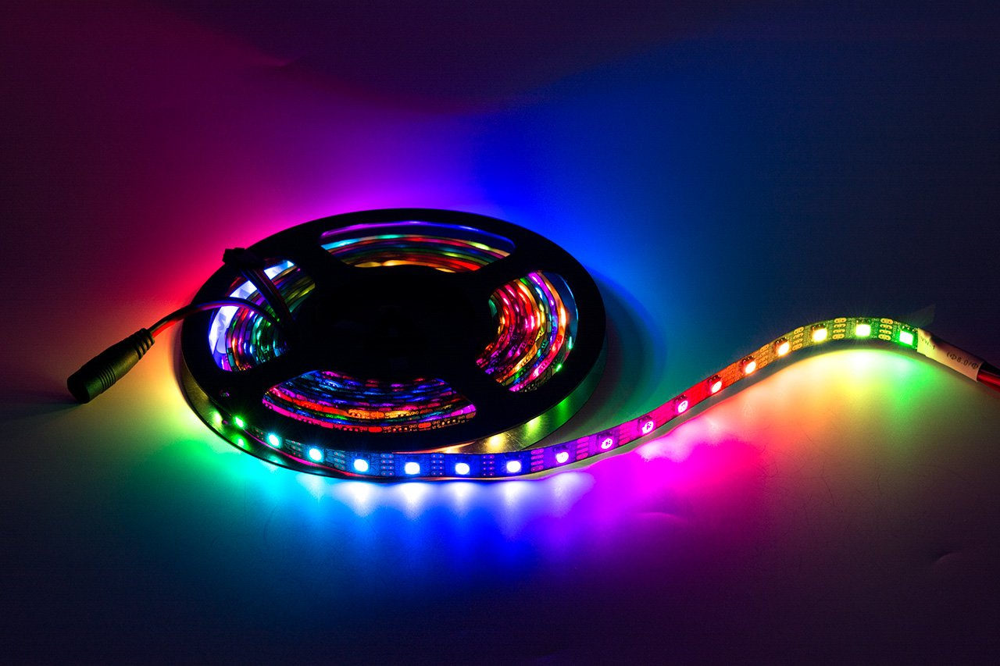

Avant de me lancer dans la version complète de la **Grenouille 3.0**, j’ai décidé de monter un **proto réduit**.  
L’objectif est simple : tester toutes les briques essentielles (détection, affichage, son, LEDs) mais en version limitée, avec exactement les mêmes composants que ceux que j’utiliserai dans le jeu final.  

Ce proto me sert de **terrain d’expérimentation** avant de passer à l’intégration complète.

## 🎯 Objectifs du proto
- Tester la **détection** avec quelques capteurs piézo.  
- Faire tourner un **panneau LED HUB75** pour l’affichage des scores.  
- Valider un **ruban LED APA102** pour les effets lumineux.  
- Lire des **sons via DFPlayer Mini** et les amplifier.  
- Vérifier la **gestion des alimentations séparées**.  

## 📦 Les briques principales du proto

### 1. Base ESP32

Un ESP32-S3 DevKit qui sert de cerveau au système.  
👉 [Lire la suite →](proto-esp32)

### 2. Détection (MCP3008 + piézos)

Je pars avec 4 capteurs piézo pour valider le montage complet (résistances, diodes, filtrage).  
👉 [Lire la suite →](/grenouille-proto-detection)

### 3. Affichage HUB75

Un panneau LED HUB75 64x32 (128x64 au final) (scan 1/16) pour afficher scores et messages.  
👉 [Lire la suite →](proto-matrix-led-display)

### 4. LEDs APA102

Un petit ruban de 30 LED pour tester les effets lumineux indépendants.  
👉 [Lire la suite →](proto-leds)

### 5. Audio (DFPlayer + ampli + HP)
Lecture de sons depuis µSD, amplification via TPA3116 et restitution dans un caisson clos de 4,3 L.  
👉 [Lire la suite →](proto-audio)

### 6. Alimentation

Séparation claire des rails :  
- 5 V dédié HUB75  
- 5 V logique/LEDs/DFPlayer  
- 12 V pour l’ampli audio  
👉 [Lire la suite →](proto-alimentation)

## ✅ Résumé visuel

## 🚀 La suite
Ce proto me permettra de :
- vérifier que chaque brique fonctionne bien,  
- valider le câblage et la gestion des masses,  
- préparer les **articles détaillés** avec schémas, codes et retours d’expérience.  