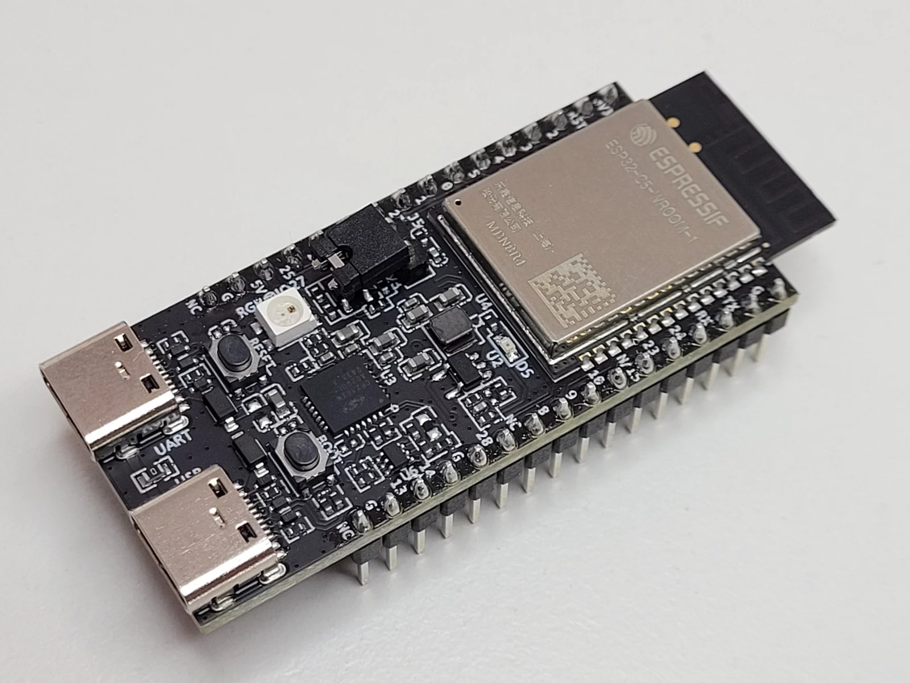
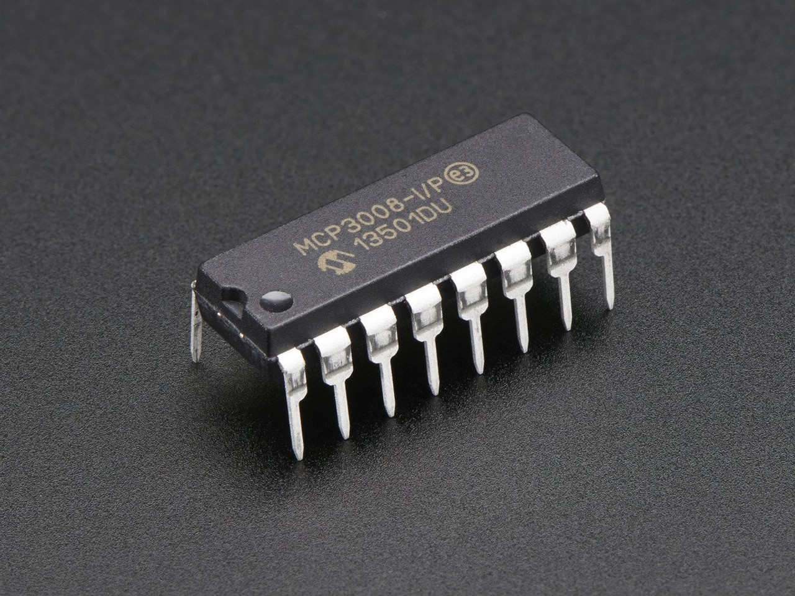
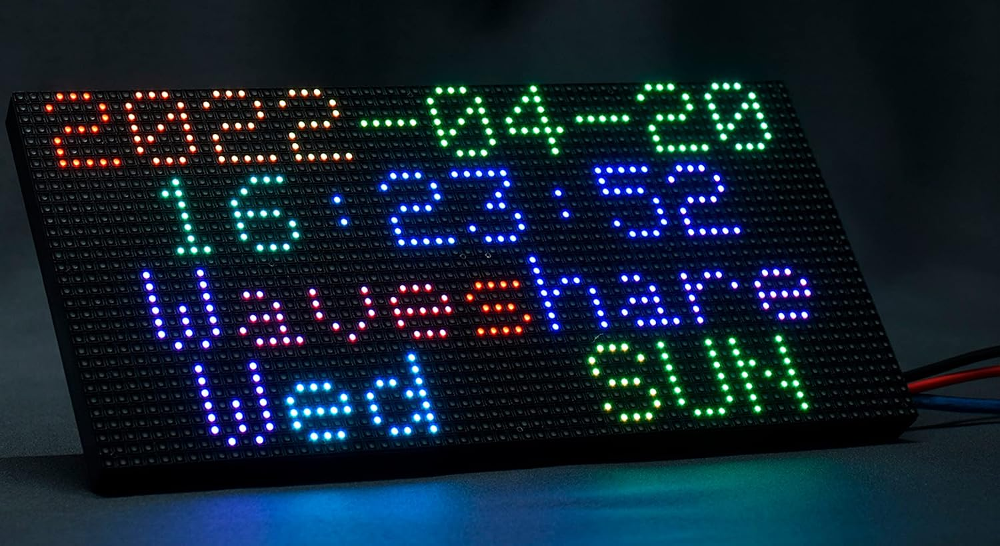
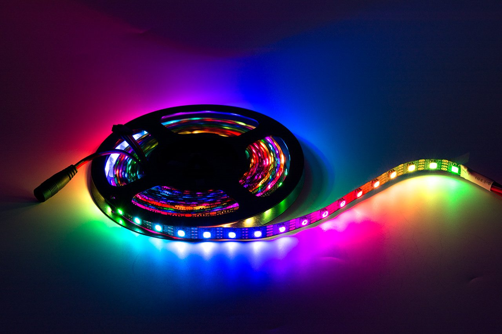
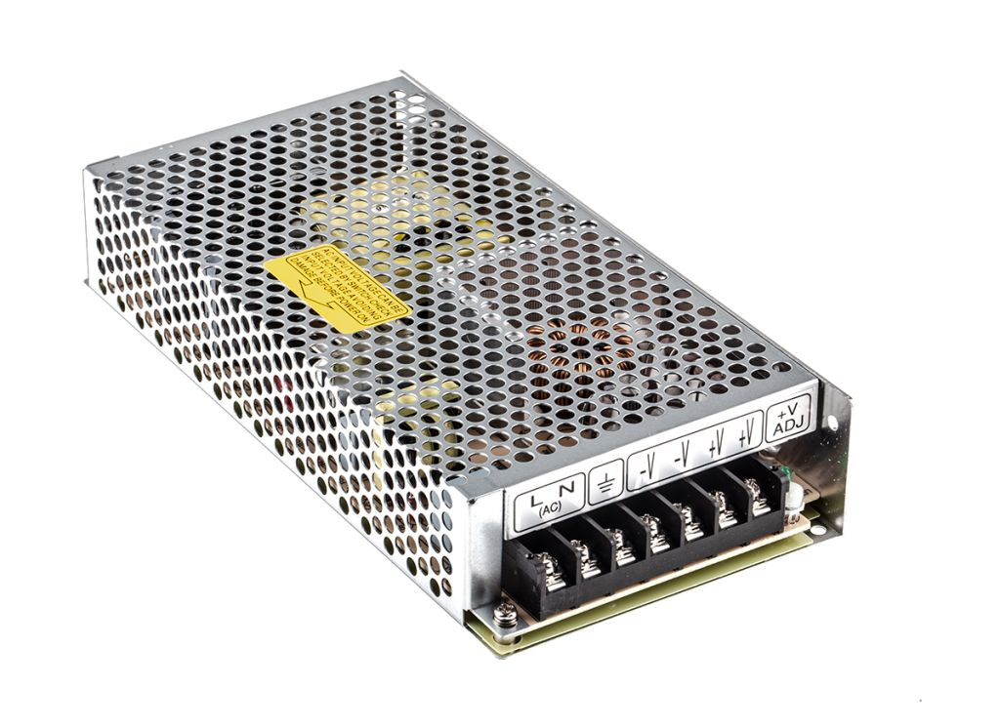


Avant de me lancer dans la version complète de la **Grenouille 3.0**, j’ai voulu monter un **proto réduit** pour valider les briques critiques une par une.
L’idée n’est pas de fabriquer un mini-jeu fini, mais de sécuriser les choix techniques avant l’intégration dans le meuble final.


Ce proto me sert donc de **terrain d’expérimentation**.  
Je reprends les composants clés du projet final, mais dans un format volontairement simple à câbler, tester et modifier.

## Ce que le proto doit valider
- Tester la **détection** avec quelques capteurs piézo.  
- Faire tourner un **panneau LED HUB75** pour l’affichage des scores.  
- Valider un **ruban LED APA102** pour les effets lumineux.  
- Lire des **sons via DFPlayer Mini** et les amplifier.  
- Vérifier la **gestion des alimentations séparées**.  

## Les briques principales

### 1. Base ESP32

Un ESP32-S3 DevKit sert de cerveau au système.
Je m’appuie dessus pour centraliser la lecture des entrées, piloter l’affichage, déclencher les sons et gérer les effets lumineux.

Article dédié : à venir.

### 2. Détection (MCP3008 + piézos)

Je pars avec 4 capteurs piézo pour valider le montage complet : protection, filtrage, lecture analogique et premiers seuils de déclenchement.

Article détaillé : [proto détection MCP3008 + capteurs piézo]().

### 3. Affichage HUB75

Un panneau LED HUB75 64x32, en attendant une cible finale en 128x64, permet de tester la chaîne d’affichage, la lisibilité et la charge logicielle.

Article dédié : à venir.

### 4. LEDs APA102

Un petit ruban de 30 LED sert à tester les effets lumineux indépendants du panneau principal.
L’objectif est de valider la réactivité, la synchronisation avec les événements de jeu et le rendu visuel.

Article dédié : à venir.

### 5. Audio (DFPlayer + ampli + HP)
Lecture de sons depuis µSD, amplification via TPA3116 et restitution dans un caisson clos de 4,3 L.
Je veux surtout vérifier ici le niveau sonore, la latence perçue et la simplicité d’intégration avec l’ESP32.

Article dédié : à venir.

### 6. Alimentation

Séparation claire des rails :  
- 5 V dédié HUB75  
- 5 V logique/LEDs/DFPlayer  
- 12 V pour l’ampli audio  

Le but est d’éviter que l’affichage, l’audio et la logique ne se perturbent mutuellement pendant les tests.

Article dédié : à venir.

## État actuel du proto

À ce stade, ce prototype me sert surtout à :

- isoler les problèmes brique par brique ;
- confirmer les bons couples composants / alimentation ;
- préparer des articles plus détaillés sans documenter “dans le flou”.

Le schéma global du proto n’est pas encore publié dans cette page.
Je l’ajouterai quand le câblage sera suffisamment stabilisé pour servir de vraie référence.

## La suite
Ce proto me permettra de :
- vérifier que chaque brique fonctionne bien,  
- valider le câblage et la gestion des masses,  
- préparer les **articles détaillés** avec schémas, codes et retours d’expérience.  

Une fois ces validations terminées, je pourrai passer plus sereinement à l’intégration dans la version complète de la **Grenouille 3.0**.
