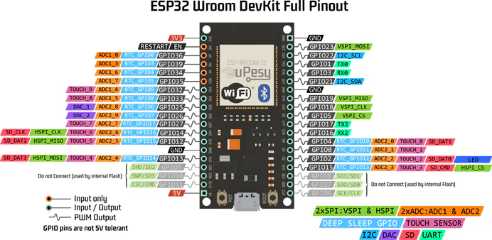

Tu cherches le **pinout complet de l’ESP32 WROOM DevKit V1** avec un schéma clair et des explications simples, directement utilisables dans tes projets ?

Tu es au bon endroit.

Dans cet article, tu vas trouver :

- Un **schéma complet du pinout ESP32**
- Les **GPIO à utiliser sans risque**
- Les **broches à éviter absolument**
- Des **exemples concrets (SPI, I2C, ADC…)**

Que tu bosses sur un projet DIY, IoT ou un projet comme mon **jeu de la grenouille électronique**, ce guide va t’éviter **les erreurs classiques qui font perdre des heures**.

---

## Comprendre le pinout ESP32 en un coup d’œil

Voici le **schéma complet du brochage ESP32 WROOM DevKit V1** avec toutes les fonctions principales :

- GPIO numériques
- ADC / DAC
- interfaces SPI / I2C / UART
- broches critiques au démarrage

---

## Les grandes familles de broches

### Alimentation & Masse  

- **3V3** : sortie du régulateur intégré  
- **GND** : masse commune  
- **VIN / 5V** : alimentation externe  

---

### GPIO numériques & périphériques  

Grâce à l’ESP32, les pins sont très flexibles :

- Digital
- PWM
- I²C
- SPI
- UART

GPIO “sûres” :

**4, 5, 16, 17, 18, 19, 21, 22, 23, 25, 26, 27, 32, 33**

---

### ADC / DAC / Tactile  

- **ADC1 / ADC2** pour entrées analogiques  
- **DAC** : GPIO 25 et 26  
- **Touch** : GPIO 0, 2, 4, 12–15, 27, 32, 33  

> ⚠️ Les broches **ADC2 ne fonctionnent pas correctement avec le Wi-Fi actif**

Pour des mesures fiables, privilégie :

**GPIO 32–39 (ADC1)**

---

### Interfaces de communication  

| Interface | Broches | Remarque |
|----------|--------|---------|
| I²C | 21 / 22 | Par défaut |
| SPI | 23 / 19 / 18 / 5 | VSPI |
| UART | 1 / 3 • 16 / 17 | UART0 = USB |

---

## Broches sensibles / à éviter  

| GPIO | Problème | Recommandation |
|------|--------|---------------|
| 6 → 11 | Flash interne | ❌ Jamais |
| 0 | Boot mode | ⚠️ Attention |
| 2 | Boot | ⚠️ Attention |
| 12 | Bloque boot | ⚠️ À éviter |
| 15 | Boot | ⚠️ À éviter |
| 34 → 39 | Input only | ✅ Capteurs |

---

## Broches sûres et usages recommandés  

| Usage | GPIO | Exemple |
|------|------|--------|
| LED / PWM | 25, 26, 27 | LED |
| Analogique | 32, 33, 34 | Piézo |
| I²C | 21, 22 | OLED |
| SPI | 18, 19, 23, 5 | MCP3008 |
| UART | 16, 17 | GPS |

---

## Erreurs fréquentes avec l’ESP32  

Voici les erreurs classiques :

- Utiliser **GPIO 6–11** → bloque tout  
- Mettre une LED sur **GPIO 0 ou 2** → boot KO  
- Utiliser **ADC2 + Wi-Fi** → valeurs instables  
- Envoyer du **5V dans un GPIO** → destruction  

👉 Si ton ESP32 ne démarre pas, **c’est souvent ici que ça se joue**.

---

## Conseils pratiques  

- Toujours relier les **GND ensemble**  
- Utiliser une **alim externe** si besoin  
- Éviter les conflits dès le design  

---

## Ressources utiles  

- 🔗 **[uPesy — ESP32 Pinout Reference (FR)](https://www.upesy.fr/blogs/tutorials/esp32-pinout-reference-gpio-pins-ultimate-guide)**  
- 🔗 **[Random Nerd Tutorials — ESP32 Pinout Reference (EN)](https://randomnerdtutorials.com/esp32-pinout-reference-gpios/)**  
- 🔗 **[LastMinuteEngineers — ESP32 WROOM-32 GPIO Guide (EN)](https://lastminuteengineers.com/esp32-wroom-32-pinout-reference/)**  
- 🔗 **[Espressif — ESP32 Hardware Design Guidelines (PDF officiel)](https://www.espressif.com/sites/default/files/documentation/esp32_hardware_design_guidelines_en.pdf)**
- 🔗 **[Documentation Espressif officielle (ESP-IDF)](https://docs.espressif.com/projects/esp-idf/en/latest/esp32/hw-reference/index.html)**  

## En résumé  

- ✅ **GPIO 25–27 / 32–33** → zones sûres pour tests  
- ⚠️ **GPIO 0 / 2 / 12 / 15** → attention au boot  
- ❌ **GPIO 6–11** → réservées à la Flash  
- 🧮 **GPIO 34–39** → entrées uniquement  
- 🔋 Alim toujours en **3.3 V** sur les GPIO  
- 📶 Évite **ADC2** si le Wi-Fi est actif  

---

## Aller plus loin avec l’ESP32

- 🔗 **[Détection de vibration avec un capteur piézo et un esp32]()**
- 🔗 **[Projet Grenouille électronique]()**
